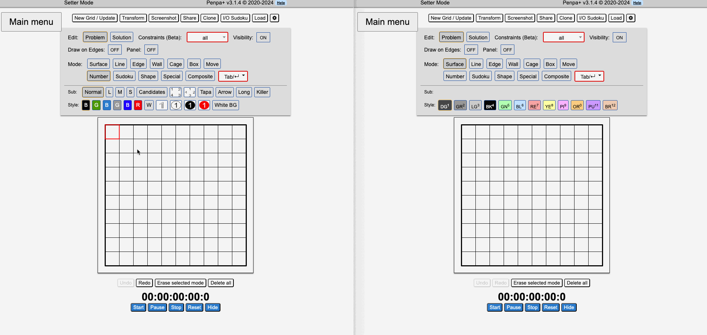

# Collaborative Penpa

This is a collaborative version of the puzzle editor tool [Penpa-Edit](https://github.com/swaroopg92/penpa-edit). Multiple users can edit or solve a puzzle simultaneously.

See the link in the About section for a demo server. No guarantees are given for this demo server; it may be turned off or puzzles may be deleted at any time.

## Instructions

This was tested with Node 20.18.1.

### One-time setup

    git clone https://github.com/kevinychen/collaborative-penpa.git
    cd collaborative-penpa
    npm install
    git submodule update --init

### Running the server

    npm start

Then go to http://localhost:8080.

To use this with friends over the Internet, you must run the above on a machine with a public IP.

